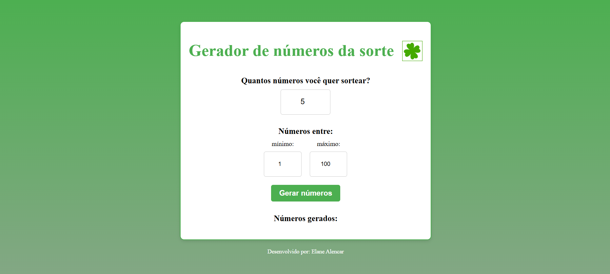

# ✨ Gerador de Números da Sorte ✨

Um aplicativo simples para gerar números da sorte de forma aleatória, respeitando uma faixa definida pelo usuário.

## ✨ Tecnologias Utilizadas

- **HTML5**
- **CSS3** (com gradiente e responsividade)
- **JavaScript** (para gerar números aleatórios e evitar repetições)

## ✨ Funcionalidades

- Permite ao usuário definir a quantidade de números a serem gerados.
- Define um intervalo personalizado (mínimo e máximo).
- Os números são organizados em ordem crescente.
- Evita a repetição de números.
- Exibição visual aprimorada com **bordas arredondadas** para cada número.
- Design responsivo.

## ✨ Como Usar

1. Clone o repositório:
```sh
  git clone https://github.com/seu-usuario/gerador-numeros-sorte.git
```

2. Acesse o diretório do projeto:
```sh
  cd gerador-numeros-sorte
```

3. Abra o arquivo `index.html` em seu navegador.

## ✨ Captura de Tela

 <!-- Substitua pelo caminho correto da imagem -->

## ✨ Melhorias Futuras

- Adicionar a opção de salvar números gerados.
- Permitir compartilhamento dos números.
- Implementar animação na exibição dos números.

## ✨ Autor

Feito por **[Elane Alencar](https://github.com/elanealencar)**.

Se gostou do projeto, não esqueça de deixar uma ⭐! 😃

